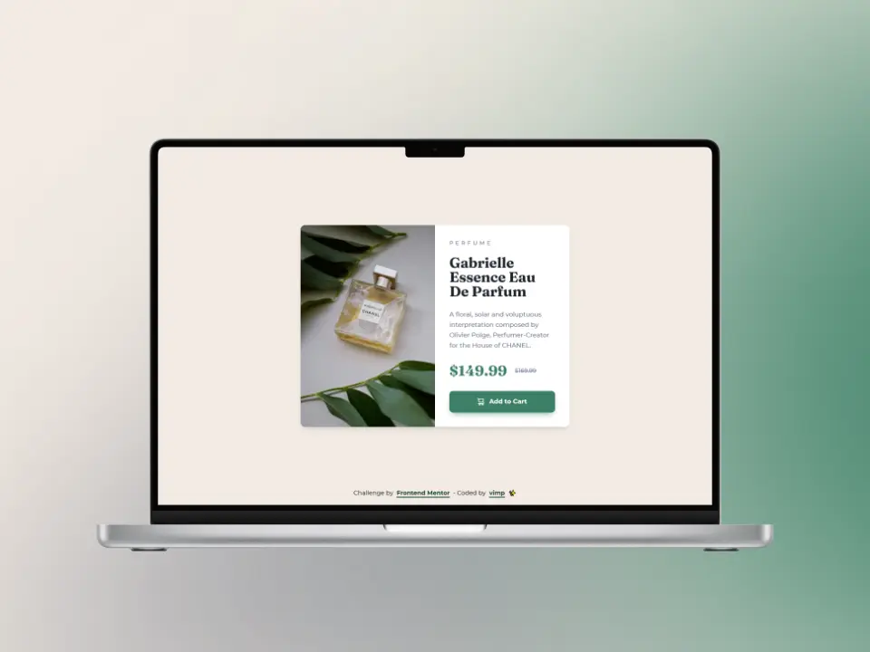

# Frontend Mentor - Product preview card component solution

This is a solution to the [Product preview card component challenge on Frontend Mentor](https://www.frontendmentor.io/challenges/product-preview-card-component-GO7UmttRfa).

Frontend Mentor challenges help you improve your coding skills by building realistic projects.

## Table of contents

- [Overview](#overview)
  - [The challenge](#the-challenge)
  - [Screenshot](#screenshot)
  - [Links](#links)
- [My process](#my-process)
  - [Built with](#built-with)
  - [Useful resources](#useful-resources)
- [Author](#author)

## Overview

### The challenge

Users should be able to:

🎯 View the optimal layout depending on their device's screen size

🎯 See hover and focus states for interactive elements

### Screenshot

#### 📱 Mobile

#### 💻 Desktop

### Links

[Demo](https://mendez-v.github.io/product-preview-card/) 👀

<!-- [Frontend Mentor](https://your-live-site-url.com) 👀 -->

## My process

### Built with

✅ Semantic HTML5 markup

✅ Mobile-first workflow

✅ CSS custom properties

✅ Utility classes

✅ Flexbox

✅ CSS Grid

### Useful resources

🖼 [Perfume](https://iconscout.com/icons/perfume) by [Aghadhia Designs](https://iconscout.com/contributors/aghadhiadesigns) on [IconScout](https://iconscout.com)

## Author

✨ Frontend Mentor - [@mendez-v](https://www.frontendmentor.io/profile/mendez-v)
